# Java Application Modernization with GitHub Copilot

[](https://openjdk.org/)
[](https://spring.io/projects/spring-boot)
[](https://azure.microsoft.com/)
[](LICENSE)

This repository demonstrates **end-to-end Java application modernization** using **GitHub Copilot App Modernization** extension. It showcases a complete journey from a legacy Java 8 / Spring Boot 2.7 application with AWS dependencies to a modern, containerized, cloud-native application running on Azure.

## 📖 Table of Contents

- [Overview](#overview)
- [About Assets Manager](#about-assets-manager)
- [Architecture Evolution](#architecture-evolution)
- [Prerequisites](#prerequisites)
- [Getting Started](#getting-started)
- [Solution Structure](#solution-structure)
- [Branch Structure](#branch-structure)
- [Modernization Guide](#modernization-guide)
- [Contributing](#contributing)

---

## 🎯 Overview

This repository serves as a **hands-on sample** for modernizing legacy Java applications using AI-powered tools. The `main` branch contains the original legacy codebase, and each subsequent branch represents a stage in the modernization process, driven by GitHub Copilot.

### Modernization Workflow Stages

```
Assess → Upgrade → Unit Tests → CVE Check → Cloud Migration Readiness → Containerize → Deploy
```

Each branch demonstrates:
- ✅ Specific modernization tasks completed
- 📝 Code changes and refactoring
- 🔧 Configuration updates
- 📚 Documentation and lessons learned

---

## 🏗️ About Assets Manager

**Assets Manager** is a file management application that showcases common patterns found in enterprise Java applications. It's an ideal candidate for modernization as it contains:

- Multi-module Maven project structure
- AWS SDK dependencies (S3 storage)
- Older Java and Spring Boot versions
- Message-driven processing with RabbitMQ
- Relational data access with Spring Data JPA

### Current State (Legacy — `main` branch)

| Component | Technology |
|-----------|------------|
| **Language** | Java 8 |
| **Framework** | Spring Boot 2.7.18 |
| **Build Tool** | Maven 3.x |
| **ORM** | Spring Data JPA / Hibernate |
| **Messaging** | RabbitMQ via Spring AMQP |
| **File Storage** | AWS S3 |
| **Database** | PostgreSQL |
| **Hosting** | Local / bare-metal |

### Target State (Modernized)

| Component | Technology |
|-----------|------------|
| **Language** | Java 21 |
| **Framework** | Spring Boot 3.3.7 |
| **Build Tool** | Maven 3.x |
| **ORM** | Spring Data JPA / Hibernate (Jakarta EE) |
| **Messaging** | RabbitMQ via Spring AMQP |
| **File Storage** | Azure Blob Storage |
| **Database** | PostgreSQL |
| **Hosting** | Azure Container Apps |
| **Containerization** | Docker (multi-stage builds) |

---

## 🚀 Architecture Evolution

### Legacy Architecture (main)

```
User → Web App (HTTP/8080) → AWS S3 (file upload)
                            → RabbitMQ (publish message)
                            → PostgreSQL (metadata)

RabbitMQ → Worker App → AWS S3 (download/upload thumbnail)
                      → PostgreSQL (update metadata)
```

### Modernized Architecture (containerized_app)

```
User → Web App (HTTP/8080) → Azure Blob Storage (file upload, Managed Identity)
                            → RabbitMQ (publish message)
                            → PostgreSQL (metadata)

RabbitMQ → Worker App → Azure Blob Storage (download/upload thumbnail)
                      → PostgreSQL (update metadata)
```

### Core Functionality

- 📤 **File Upload**: Upload images through a web UI
- 🖼️ **Thumbnail Generation**: Automatic background processing via message queue
- 📋 **Image Metadata**: Track uploaded files and their processing status
- 🔍 **File Browsing**: View and manage uploaded assets

---

## ✅ Prerequisites

### For Running the Legacy Application (main branch)

- **JDK 8** (or use the provided dev container — see [DEV-SETUP.md](DEV-SETUP.md))
- **Maven 3.x**
- **PostgreSQL 16**
- **RabbitMQ 3.x**
- **AWS credentials** (for S3 storage) or use `dev` profile for local file storage

### For Modernization (working with branches)

- **IDE**:
  - Visual Studio Code with Java Extension Pack and GitHub Copilot
  - OR IntelliJ IDEA with GitHub Copilot plugin
- **JDK 21** (or use the dev container)
- **Docker Desktop** (for containerization stages)
- **Azure Account** (for cloud deployment)
- **Azure CLI** and **Azure Developer CLI (azd)** (for Azure deployment)
- **Git**

### Dev Container (Recommended)

The easiest way to get started is with the included dev container, which provides all dependencies automatically. See [DEV-SETUP.md](DEV-SETUP.md) for setup instructions.

---

## 🏃 Getting Started

### Running the Legacy Application

1. **Clone the repository**
   ```bash
   git clone https://github.com/sitoader/ghcp-java-app-moderization-sample.git
   cd ghcp-java-app-moderization-sample
   ```

2. **Open in a dev container** (recommended)
   - VS Code: Command Palette → *Dev Containers: Reopen in Container* → select **Asset Manager - JDK 8 (Source)**
   - Or install JDK 8, PostgreSQL, and RabbitMQ locally

3. **Run the application**
   ```bash
   # Start the web module
   ./mvnw -pl web spring-boot:run

   # In a separate terminal, start the worker module
   ./mvnw -pl worker spring-boot:run
   ```

4. **Open the app**

   | Service | URL | Credentials |
   |---------|-----|-------------|
   | Web app | http://localhost:8080 | — |
   | RabbitMQ management | http://localhost:15672 | `guest` / `guest` |

### Exploring Modernization Branches

```bash
# List all branches
git branch -a

# Switch to a specific branch (e.g., java-upgrade)
git checkout java-upgrade

# Compare changes between stages
git diff main..assess
git diff main..java-upgrade
git diff java-upgrade..resolve-CVEs
```

---

## 📁 Solution Structure

```
ghcp-java-app-moderization-sample/
|── web/                           # Web application module
│   ├── pom.xml
│   ├── Dockerfile
│   └── src/main/java/com/microsoft/migration/assets/
│       ├── AssetsManagerApplication.java    # Entry point
│       ├── config/                          # Configuration classes
│       ├── controller/                      # MVC controllers
│       ├── model/                           # Domain models
│       └── service/                         # Business logic
│
├── worker/                        # Worker application module
│   ├── pom.xml
│   ├── Dockerfile
│   └── src/main/java/com/microsoft/migration/assets/worker/
│       ├── WorkerApplication.java           # Entry point
│       ├── config/                          # Configuration classes
│       ├── model/                           # Domain models
│       └── service/                         # Processing services
│
├── infra/                         # Azure infrastructure (Bicep)
│   ├── main.bicep
│   ├── main.bicepparam
│   ├── postgres/Dockerfile
│   └── rabbitmq/Dockerfile
│
└── doc-media/                     # Documentation images
```

---

## 🌳 Branch Structure

This repository uses a **branch-per-stage** approach to demonstrate the modernization journey:

| Branch | Stage | Description |
|--------|-------|-------------|
| `main` | **Legacy Application** | Original Java 8 / Spring Boot 2.7.18 codebase with AWS S3 — starting point |
| `assess` | **Assessment & Planning** | Assessment report capturing current state analysis, modernization targets, risks, and recommended action plan |
| `java-upgrade` | **Framework Upgrade** | Incremental upgrade: Java 8 → 17 → 21, Spring Boot 2.7 → 3.2 → 3.3 with Jakarta EE migration |
| `java-upgrade-unit-tests` | **Unit Testing** | Comprehensive unit tests for web and worker modules to validate post-upgrade behavior |
| `resolve-CVEs` | **Security Scan** | Vulnerability assessment, CVE remediation, and dependency updates |
| `migration-AWS-to-Azure` | **Cloud Migration** | Migrate from AWS S3 to Azure Blob Storage with Managed Identity authentication |
| `containerized_app` | **Containerization** | Multi-stage Dockerfiles, Docker Compose, and Azure deployment infrastructure (Bicep) |

### Branch Lineage

```
main (Java 8, Spring Boot 2.7, AWS S3)
 ├── assess (assessment report & modernization plan)
 └── java-upgrade (Java 21, Spring Boot 3.3.7)
      ├── java-upgrade-unit-tests (+ comprehensive tests)
      ├── resolve-CVEs (+ vulnerability fixes)
      └── migration-AWS-to-Azure (AWS S3 → Azure Blob Storage)
           └── containerized_app (+ Docker, Compose, Azure infra)
```

### How to Use the Branches

1. **Start with `main`**: Understand the legacy application
2. **Review `assess`**: See the assessment report and modernization plan
3. **Review `java-upgrade`**: See the incremental Java/Spring Boot upgrade path
4. **Explore improvements**: `java-upgrade-unit-tests` and `resolve-CVEs` branch
5. **Follow the cloud migration**: `migration-AWS-to-Azure` replaces AWS with Azure services
6. **Review containerization**: `containerized_app` adds Docker, Compose, and Azure deployment infrastructure
7. **Compare changes**: Use `git diff` to see what changed between stages
   ```bash
   git diff main..assess
   git diff main..java-upgrade
   git diff java-upgrade..migration-AWS-to-Azure
   git diff migration-AWS-to-Azure..containerized_app
   ```

---

## 📚 Modernization Guide

This guide walks through each stage of modernizing the Assets Manager application using **GitHub Copilot App Modernization**. Each stage builds on the previous one.

> **💡 Tip**: Work through these stages sequentially. Each stage has dependencies on the previous stages' outputs.

---

### 🔍 Stage 1: Assessment & Planning (`assess`)

**Objective**: Analyze the current application architecture, identify modernization opportunities, and create a comprehensive upgrade plan.

#### Step-by-Step Instructions

**1.1 Open the Project**
- Open the project on the `main` branch

**1.2 Open the App Modernization App Modernization**
- Open the GitHub Copilot App Modernization

**1.3 Start the Assessment**
- Select **"Start Assessment"** to begin the assessment workflow

  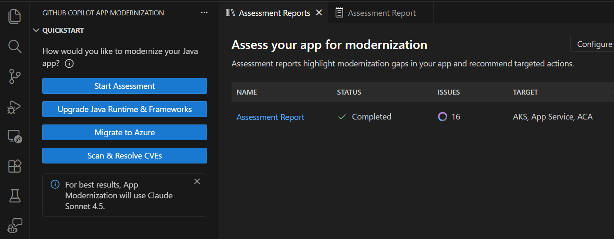

**1.4 Review the Assessment Report**
- A comprehensive assessment report is generated, covering:
  - Current state analysis (Java version, Spring Boot version, dependencies)
  - Recommended target versions
  - Potential breaking changes and blockers

  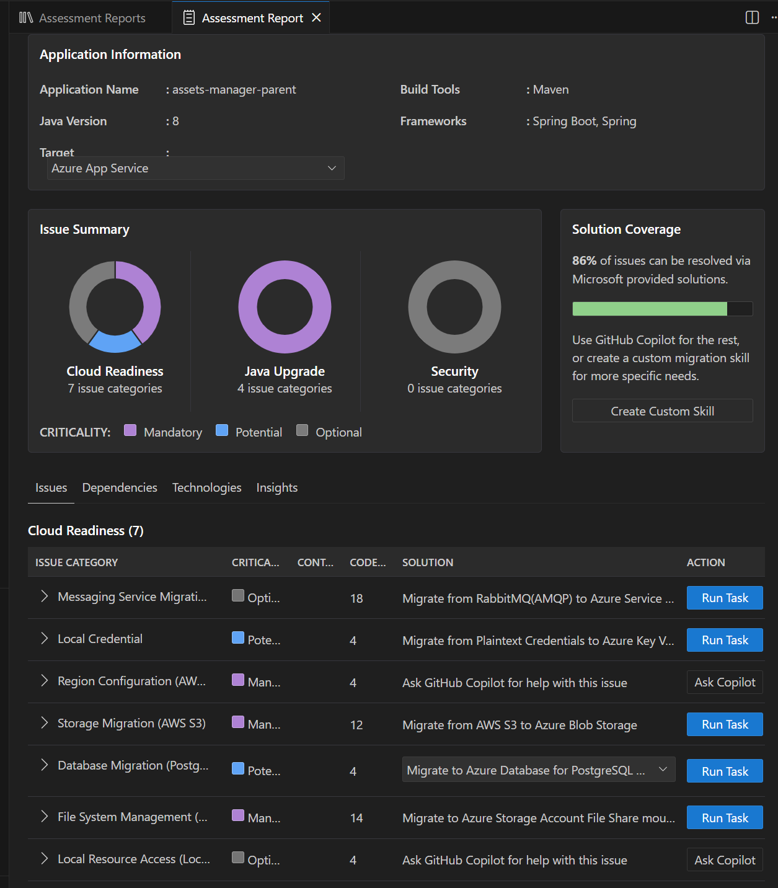

**1.5 Review Detailed Findings**
- Examine the detailed findings, including framework-specific recommendations and steps

  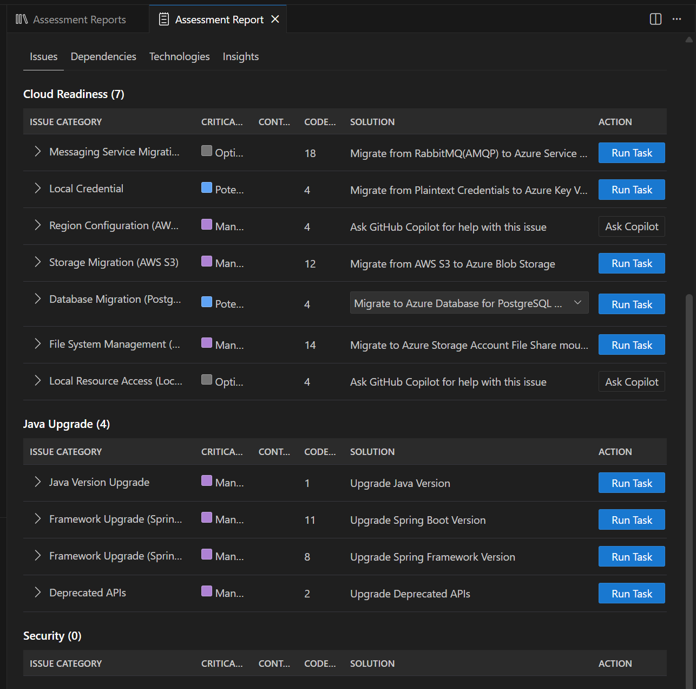

**Expected Outcome**: A clear understanding of the modernization scope, risks, and step-by-step plan before making any code changes.

---

### ⬆️ Stage 2: Java & Spring Boot Upgrade (`java-upgrade`)

**Objective**: Upgrade Java 8 → 21 and Spring Boot 2.7 → 3.3 in incremental, compilable steps.

#### Step-by-Step Instructions

**2.1 Initiate the Upgrade Process**
- Open the GitHub Copilot App Modernization
- Click **Upgrade Java Runtime & Frameworks**

  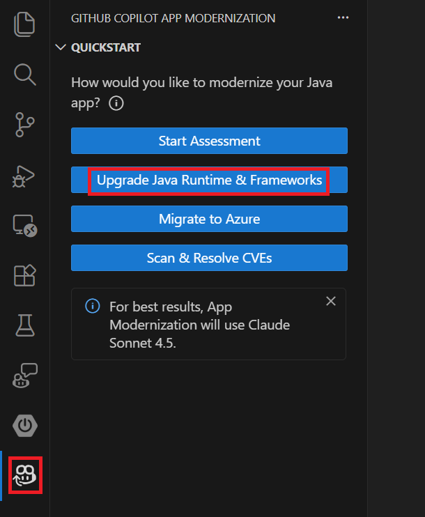

- The agent analyzes the repository — POM files, source code, dependency tree — and proposes target versions

**2.2 Review the Upgrade Plan**
- GitHub Copilot App Modernization generates a step-by-step upgrade plan and saves it to `.github/java-upgrade/`:

  ```
  plan.md       # Full upgrade plan with steps, verification commands, and challenges
  progress.md   # Step-by-step execution log
  summary.md    # Final results and post-upgrade report
  ```

**2.3 Approve and Execute the Plan**
- Review, modify if needed and approve the plan
- The agent executes each step automatically — updating POM files, migrating imports, recompiling, running tests, and committing changes at every milestone
- Each step is verified before proceeding to the next

**2.4 Review the Summary**
- Once all steps complete and final validation passes, a summary is created at `.github/java-upgrade/summary.md`
- The summary includes upgrade results, technology stack diff, commit log, CVE scan, and challenges encountered

**2.7 Verify the Upgrade**
- Run the following command to confirm the project compiles:

  ```bash
  ./mvnw clean compile
  ```

**Expected Outcome**: Project compiles with Java 21 and Spring Boot 3.3.7, all `javax` imports replaced with `jakarta`.

---

### 🧪 Stage 3: Unit Testing (`java-upgrade-unit-tests`)

**Objective**: Add comprehensive unit tests to validate application behavior post-upgrade and establish a safety net for future changes.

#### Step-by-Step Instructions

**3.1 Generate Unit Tests**
- After the Java 21 / Spring Boot 3.3.7 upgrade completes, GitHub Copilot App Modernization presents a **Proceed** option
- Click **Generate unit tests** to automatically create tests for classes with low or no coverage

  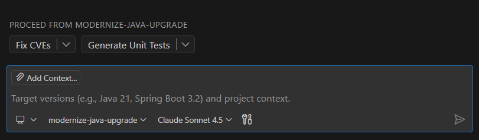

**3.2 Review the Coverage Analysis**
- A coverage analysis identifies classes with no or insufficient test coverage:

  | Module | Source Files | Test Files | Gap |
  |--------|-------------|------------|-----|
  | **web** | 14 classes | 0 test files | No coverage at all |
  | **worker** | 10 classes | 2 test files | Partial coverage |

**3.3 Review Generated Tests**
- The agent generates JUnit 5 + Mockito tests targeting the most important business-logic classes:

**3.4 Verify the Tests**
- Run the test suite and confirm all tests pass:

  ```bash
  ./mvnw clean test
  ```

  | Metric | Before | After |
  |--------|--------|-------|
  | Test files | 2 | 6 |
  | Total tests | 16 | 47 |
  | Pass rate | 100% (16/16) | 100% (47/47) |
  | Web module tests | 0 | 18 |
  | Worker module tests | 16 | 29 |

**Expected Outcome**: All tests pass, covering controllers, services, and message processors across both modules.

---

### 🔒 Stage 4: CVE Check & Vulnerability Remediation (`resolve-CVEs`)

**Objective**: Identify and fix security vulnerabilities in project dependencies.

#### Step-by-Step Instructions

**4.1 Trigger CVE Scan**
- Open **GitHub Copilot App Modernization** 
- Click **Scan and Resolve CVEs** to trigger a scan of all project dependencies

  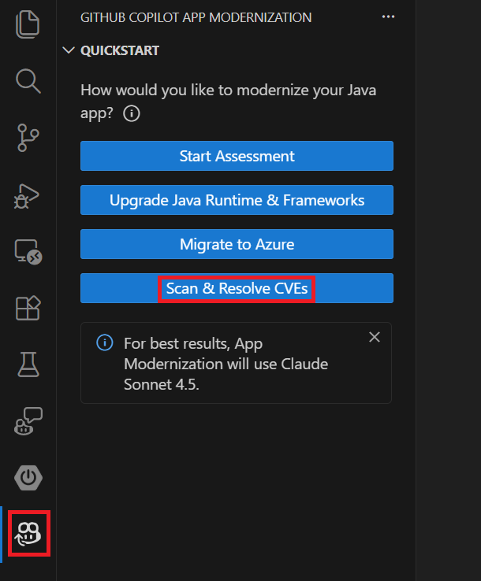

- The scan analyzes:
  - Direct dependencies declared in each module's `pom.xml`
  - Transitive dependencies resolved through the Spring Boot BOM
  - All compile and runtime scope artifacts

**4.2 Review the CVE Report**
- The scan identified **16 known vulnerabilities** across **4 dependencies**:

  

  | Dependency | Version | CVEs | Highest Severity |
  |------------|---------|------|------------------|
  | `org.apache.tomcat.embed:tomcat-embed-core` | 10.1.34 | 13 | CRITICAL |
  | `com.fasterxml.jackson.core:jackson-core` | 2.17.3 | 1 | HIGH |
  | `org.springframework.boot:spring-boot` | 3.3.7 | 1 | HIGH |
  | `org.postgresql:postgresql` | 42.7.4 | 1 | HIGH |

**4.3 Apply CVE Fixes**
- GitHub Copilot App Modernization resolves all CVEs by upgrading dependency versions in the parent `pom.xml`:

  | Change | Before | After | Method |
  |--------|--------|-------|--------|
  | Spring Boot parent | 3.3.7 | **3.3.13** | Parent POM version bump |
  | Tomcat | 10.1.34 | **10.1.52** | `<tomcat.version>` override |
  | Jackson | 2.17.3 | **2.18.6** | `<jackson-bom.version>` override |
  | Netty | 4.1.122.Final | **4.1.124.Final** | `<netty.version>` override |
  | PostgreSQL | 42.7.4 | **42.7.7** | Resolved via Spring Boot 3.3.13 BOM |

  

**4.4 Confirm Resolution**
- Ask Copilot to generate a full vulnerability assessment report summarizing the CVEs found, their severities, and the fixes applied.
- After applying the changes, a re-scan confirms **0 known vulnerabilities remaining**

**4.5 Verify the Fix**
- Run the following command to confirm everything compiles and passes:

  ```bash
  ./mvnw clean verify
  ```

**Expected Outcome**: No critical or high-severity CVEs in dependencies. Assessment report documents all findings and remediations.

---

### ☁️ Stage 5: AWS to Azure Migration (`migration-AWS-to-Azure`)

**Objective**: Replace AWS S3 dependencies with Azure Blob Storage, using Azure Identity (Managed Identity / `DefaultAzureCredential`) for authentication.

#### Step-by-Step Instructions

**5.1 Review Cloud Readiness Tasks**
- In the assessment of the project, check the **Cloud readiness tasks**
- The assessment identifies AWS-specific dependencies, configurations, and code patterns that need to be migrated to Azure equivalents

  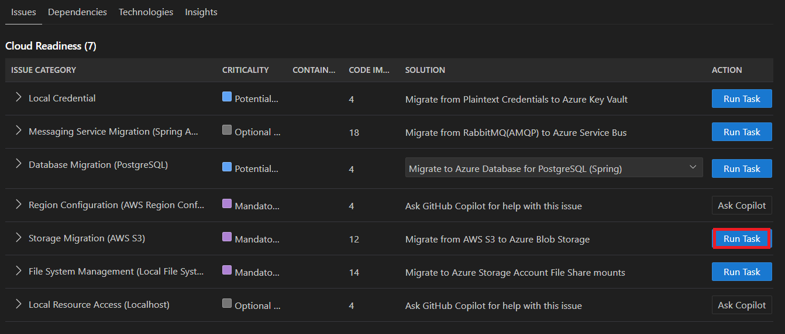

**5.2 Execute the task**

  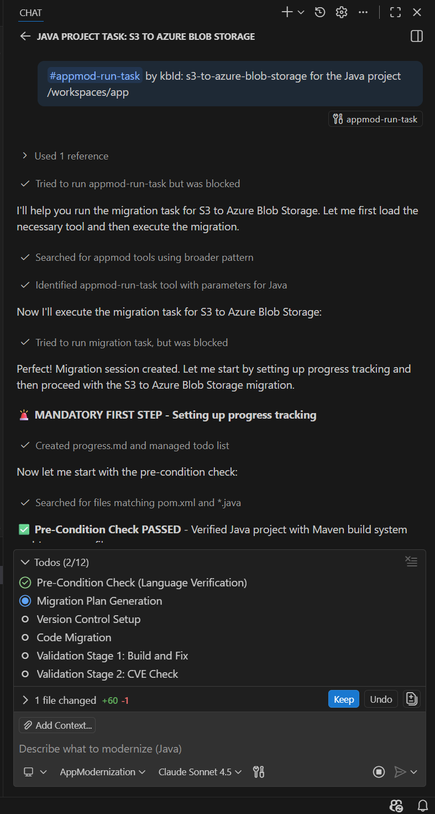

**5.4 Review the Migration Summary**
- Review the migration impact:

  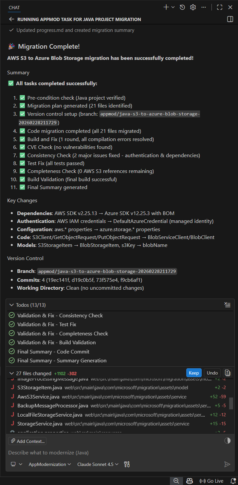

**5.5 Verify the Migration**
- **Local testing** (dev profile — uses local file storage, no Azure account needed):

  ```bash
  SPRING_PROFILES_ACTIVE=dev ./mvnw -pl web spring-boot:run
  ```

- **Azure testing** — requires additional setup before running:
    Update `application.properties` in both `web` and `worker` modules:

     ```properties
     azure.storage.account-name=<your-storage-account-name>
     azure.storage.blob.container=<your-container-name>
     ```

     Or pass them as environment variables:

     ```bash
     AZURE_STORAGE_ACCOUNT_NAME=<your-storage-account-name> \
     AZURE_STORAGE_BLOB_CONTAINER=<your-container-name> \
     ./mvnw -pl web spring-boot:run
     ```

**Expected Outcome**: All AWS references removed. Application uses Azure Blob Storage with `DefaultAzureCredential`. Local `dev` profile provides a file-system fallback for development without any Azure setup.

---

### 🐳 Stage 6: Containerization & Azure Deployment (`containerized_app`)

**Objective**: Package the application into optimized Docker containers and prepare Azure deployment infrastructure.

#### Step-by-Step Instructions

**6.1 Start Containerization**
- In the assessment of the project, check the **Cloud readiness tasks**
- Execute the Containerization task. The assessment includes a **containerization task** for preparing the application for Docker and cloud deployment

  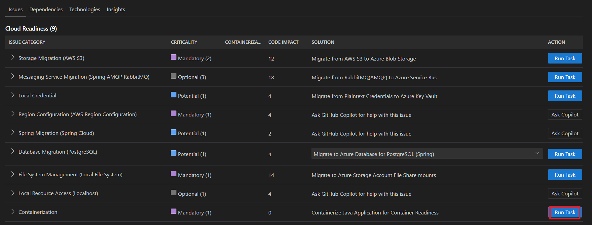


**6.2 Review the Containerization Plan**
- The agent generates a containerization plan covering Dockerfiles, Docker Compose, and Azure infrastructure

  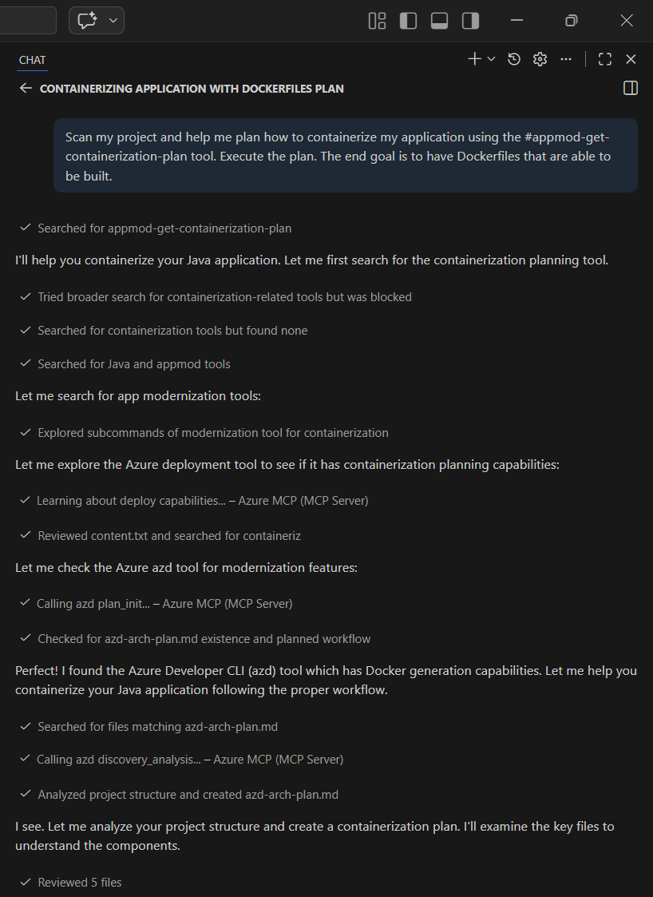

**6.3 Execute the Plan**
- After reviewing and approving the plan, the agent executes each step:
  - Creates multi-stage Dockerfiles for `web` and `worker`
  - Generates `docker-compose.yml` for the full local stack
  - Creates Bicep templates for Azure Container Apps
  - Generates `azure.yaml` for the Azure Developer CLI

- Key artifacts generated:
  - **`web/Dockerfile`** — Multi-stage build with Eclipse Temurin 21, non-root user, health check
  - **`worker/Dockerfile`** — Multi-stage build for background processing
  - **`docker-compose.yml`** — PostgreSQL, RabbitMQ, Web, and Worker services
  - **`infra/main.bicep`** — Azure Container Apps environment, registry, and app definitions
  - **`azure.yaml`** — Azure Developer CLI deployment configuration

**6.4 Build and Test Locally**
- Build and run with Docker Compose:

  ```bash
  # Build images
  docker build -t assets-manager-web:latest -f web/Dockerfile .
  docker build -t assets-manager-worker:latest -f worker/Dockerfile .

  # Start all services
  docker-compose up -d

  # View logs
  docker-compose logs -f

  # Stop
  docker-compose down
  ```

- Verify the services are running:

  | Service | URL | Credentials |
  |---------|-----|-------------|
  | Web UI | http://localhost:8080 | — |
  | RabbitMQ Management | http://localhost:15672 | `guest` / `guest` |
  | PostgreSQL | localhost:5432 | `postgres` / `postgres` |

**6.5 Deploy to Azure**
- Deploy using the Azure Developer CLI:

  ```bash
  # Login
  azd auth login

  # Deploy everything (infrastructure + containers)
  azd up
  ```

**Expected Outcome**: Application deployed to Azure Container Apps with `azd up`.


---

## 🤝 Contributing

Contributions are welcome! This repository is meant to be a learning resource for the community.

1. **Fork** the repository
2. **Create a feature branch** (`git checkout -b feature/improvement`)
3. **Make your changes** and commit
4. **Push** to your branch and **open a Pull Request**


## 📄 Support & Resources

- [Spring Boot Migration Guide](https://github.com/spring-projects/spring-boot/wiki/Spring-Boot-3.0-Migration-Guide)
- [Jakarta EE Migration](https://jakarta.ee/resources/javax-to-jakarta/)
- [Azure SDK for Java](https://learn.microsoft.com/java/azure/)
- [Azure Container Apps Documentation](https://learn.microsoft.com/azure/container-apps/)
- [GitHub Copilot Documentation](https://docs.github.com/copilot)
- [Azure Developer CLI (azd)](https://learn.microsoft.com/azure/developer/azure-developer-cli/)

## 📄 License

This project is licensed under the MIT License — see the [LICENSE](LICENSE) file for details.
